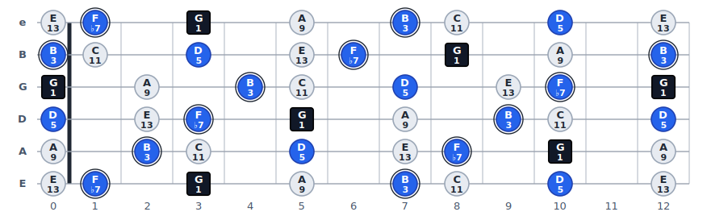

# ToneTransit

スケールとコードの関係を指板上で可視化するツール。
「今弾いている音が、現在のコードに対してどんな意味を持つのか」を表示する。

フレームワーク非依存（HTML / CSS / JS + SVG）、データ駆動。`:has()` や `aspect-ratio`、
`URLSearchParams` を使うため**モダンブラウザ前提**（最近の Chrome / Edge / Firefox / Safari）。



*C メジャー × G7 の例：四角＝ルート、リング付き＝ガイドトーン(3rd/7th)、青＝コードトーン、薄色＝スケール音。レンダラの実出力。*

## 起動

データ (`data/*.json`) を `fetch` で読み込むため、ローカルサーバー経由で開く必要がある。

```bash
cd ToneTransit
python3 -m http.server 8000
# ブラウザで http://localhost:8000 を開く
```

`index.html` をファイルとして直接開くと、ブラウザの CORS 制限で JSON が読めない点に注意。

## 使い方

### スケールカード
- **ルート** — スケールのルート音
- **スケール** — インクリメンタルサーチ付き（音名・カナ・かな・英名で検索可。例「ドリアン」「dorian」）
- **スケールなし** — チェックすると、スケールを重ねずコードトーンだけを表示。音名の綴りはコードのルート基準に切り替わる

### コードカード
- **ルート / 種類** — スケールとは独立に「どのコードから見るか」を選ぶ
- **コードなし** — チェックするとコードを重ねずスケールのみ表示
- **おすすめ** — そのスケールでよく使うコードのクイックピック（★＝そのスケールが乗る対象コード）。クリックで即適用

### 表示（プレビュー上部のツールバー）
- **表示（ラベル）** — 音名 / 度数 / 音名＋度数（ノートに何を書くか）
- **配色** — カラー / モノトーン。画面・印刷の両方に反映（モノトーンはカラー非対応プリンタ向けに無彩色のみで表現）
- **フレット範囲** — 0–24 の任意の範囲
- **印刷 / PDF** — そのまま `Ctrl/Cmd + P`。プレビューは **A4 横**で出力される
- **共有リンク** — 現在の状態を URL にしてコピー

状態は URL パラメータと `localStorage` に保存される（URL が優先）。
URL パラメータ: `root` `scale` `chord`（例: `G7`）`from` `to` `mode`（ラベル）`pal`（配色）
`nochord` `noscale`。

## 配色とマーカーの区別

色だけに頼らず、形・塗り・リングでも冗長に区別する（色覚に依存しない）。マーカーの役割は 5 種類:

| 役割 | カラー | モノトーン |
|---|---|---|
| ルート (1) | 濃色の**四角** | 黒の四角 |
| コードトーン | 青の丸 | 中グレーの丸 |
| ガイドトーン (3rd / 7th) | 青の丸＋**リング** | 黒の丸＋リング |
| スケール音 / テンション | 薄色の丸 | 薄グレーの丸 |
| コードトーン（スケール外）| 丸＋**破線リング** | 白丸＋破線リング |

「コードトーン（スケール外）」は、選んだコードの構成音がスケールに含まれない＝スケールとコードが
噛み合っていないことを示す。

## 構成

```
index.html
css/   app.css（画面）, print.css（印刷ページ設定・chrome 非表示）
js/    music-theory.js（純粋な楽典）, fretboard.js（モデル生成）,
       renderer.js（SVG 描画）, app.js（状態・配線）
data/  scales.json, chords.json
```

## テスト

追加依存ゼロ。Node 標準の `node:test` だけで動く。

```bash
npm test        # = node --test
```

`test/` の内容:
- `music-theory.test.js` — 度数計算・音名綴り・スケール度数・おすすめコード生成
- `fretboard.test.js` — コード記号のパース、モデル生成、スケールなし/コードなし、スケール外コードトーン
- `renderer.test.js` — 最小 DOM スタブで SVG 構造（マーカー数・ナット・ルートの四角・リング）を検証
- `data.test.js` — `scales.json` / `chords.json` の妥当性（音程・度数対応・必須フィールド）

## スケール / コードの追加（データスキーマ）

プログラムを変更せず、`data/*.json` に定義を足すだけで増やせる。ただし `intervals` だけでは
検索・グループ分け・おすすめが機能しないので、下記フィールドを揃えること。

### scales.json

```json
"dorian": {
  "name": "Dorian",                       // 表示名（必須）
  "category": "メジャー系モード",          // コンボボックスのグループ見出し（無いと「その他」）
  "description": "♮6を持つ短調モード。…",  // カード/プレビューの解説（任意）
  "kana": ["ドリアン"],                    // カナ/かな検索のヒット語（任意）
  "over": ["m7"],                          // このスケールが乗る対象コードの key 配列（★表示）
  "common": [[5, "7"], [10, "maj7"]],      // よく使うコード [ルートからの半音, chordKey] の配列
  "intervals": [0, 2, 3, 5, 7, 9, 10]      // ルートからの半音（0始まり・昇順・必須）
}
```

- `over` / `common` … 「おすすめ」コードの生成元。どちらも無い場合は `intervals` から
  ダイアトニックコードを自動算出してフォールバックする。
- `category` が無いと「その他」グループに、`kana` が無いとカナ検索でヒットしない。

### chords.json

```json
"maj9": {
  "name": "Major 9",                       // 表示名（必須）
  "symbol": "maj9",                        // ルートに付く表記（"Cmaj9" の "maj9"）
  "group": "テンション",                    // 種類ドロップダウンのグループ見出し（optgroup）
  "description": "メジャー7th＋9度…",      // 解説（任意）
  "intervals": [0, 4, 7, 11, 14],          // ルートからの半音（9th=14 等、12超も可）
  "degrees": ["1", "3", "5", "7", "9"],    // intervals と同じ並びの度数表記（必須）
  "aliases": ["maj9", "M9"]                // コード記号パース用の別名（任意）
}
```

種類ドロップダウンの**並び順**は `js/app.js` の `CHORD_ORDER` で固定（`"7"` 等の数値的キーは
オブジェクトの挿入順を保てないため）。新しいコードは `CHORD_ORDER` に追加すると所定の位置に並ぶ
（未追加でも末尾の「その他」グループに表示される）。

`degrees` はそのコード固有の度数表記。コードに含まれない音は、ドミナント基準の
汎用テンション表（`♭9 / 9 / ♯9 / 11 / ♯11 / ♭13 / 13` …）で自動的にラベル付けされる。
